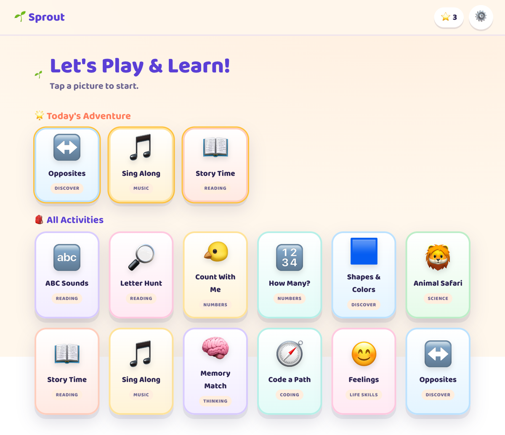

# 🌱 Sprout — A Learning Playground for Little Ones

> _"Where curious kids grow."_
> An audio-first, interactive learning playground for children **ages 2–6**, with a
> matching **screen-free printable pack**. Built for a 4-year-old and a 2-year-old —
> and designed to grow into a real product.



## 🚀 Live demo &amp; install

**Play now / install:** **https://bharatgupta777.github.io/sprout/**

Scan to open on your phone, then use **Add to Home Screen** for an offline, full-screen app:


## Why it's different

Toddlers and preschoolers **can't read yet**, so most "learning apps" fail them.
Sprout is built around that reality:

- **🔊 Audio-first.** Every prompt, label, and reward is spoken aloud, so a child
  who can't read can play **100% independently**. Tap the prompt to hear it again.
- **🚫 No failure, only encouragement.** Wrong taps get a gentle, kind nudge — never
  a buzzer, never a "game over."
- **👆 Huge, forgiving touch targets.** Perfect for little fingers on a tablet.
- **🎉 Short loops, big celebration.** Stars, confetti, and a cheering mascot.
- **🧘 Calm & safe.** No ads, no links out, no chat, **no data collection, no internet
  required.** COPPA-friendly by construction.
- **👪 Parent-gated zone** for settings, progress, and the printable pack.

## What’s new

- **51 activities** now live across 9 home-screen groups.
- **Trace & Learn** activity added for early childhood tracing of lines, letters, shapes, and numbers.
- **Lego Blocks** redesigned to be an interactive 3D block-building sandbox and copying game.
- **Family & Home** features added: Family Photos, Family Voices, Family Match, Family Editor, Pretend Home, and Request a Snack.
- **Toddler-first play** expanded with Pop & Play, Peekaboo, Find the Object, and Mirror Moves.
- Fully installable offline PWA with deployment-ready configs for Netlify, Vercel, and GitHub Pages.

## What's inside

**51 activities** across 9 friendly groups so every child can find a way to play and learn.
The home screen now includes toddler-first experiences, letters and words, numbers and logic,
games, world discovery, stories and songs, feelings, family and home, plus creative play.

Some highlights:

- **Just for Tots:** Pop & Play, Peekaboo, Find the Object — simple, no-wrong-touch play.
- **Letters & Words:** ABC Sounds, Letter Hunt, First Words, Hindi Words, Word Pop, Rhyming Pairs, Finish the Sound, Trace & Learn.
- **Numbers & Logic:** Count With Me, How Many?, What's Next?, Code a Path, Lego Blocks (3D Assembly).
- **Games:** Tic Tac Toe, Memory Match, Tap the Animals, Copy the Tune, Spot the Difference.
- **Discover the World:** Animal Safari, Baby Animal Match, Animal Sound Match, Color Sorting,
  Means of Transport, Food Sort, Healthy vs Junk Food, Opposites, Community Helpers, Festival Match, Life Cycles.
- **Stories & Songs:** Story Time, Sing Along, Music Maker.
- **Feelings & Me:** Feelings, Emotion Match, Mirror Moves, Good Manners.
- **Family & Home:** Family Photos, Family Voices, Family Match, Family Editor, Pretend Home, Request a Snack.
- **Create:** Color In, Draw & Paint, Sticker Scene, Funny Voices.

Plus:

- **🌟 Today's Adventure** — a fresh, stable-for-the-day pick of 3 activities, so there's
  a new path every day.
- **🎚️ Soft age levels** — a "Younger / Older" mode tunes difficulty for toddlers and preschoolers.
- **👪 Family & Home zone** — add family photos, voice recordings, and custom family vocabulary.
- **🖨️ Printable Activity Pack** — tracing, counting, shapes, coloring pages, dot-to-dot, a maze, and a parent guide for screen-free days.
- **📖 Growth & Health Guide** (in the parent zone) — weight/height ranges, milestones, and India-focused meal & snack ideas for ages 2–6. See also [`docs/PARENT_GUIDE.md`](./docs/PARENT_GUIDE.md).
## Progress so far
- Built a rich, installable offline PWA with **51 activities** across 9 home-screen groups.
- Added toddler-first experiences like **Pop & Play, Peekaboo, Find the Object, Mirror Moves**, and family-focused features such as **Family Photos, Family Voices, Family Match, and Family Editor**.
- Added **Trace & Learn** drawing guide activity (lines, letters, shapes, numbers) and rebuilt **Lego Blocks** into an interactive 3D grid assembly sandbox/challenge board.
- Expanded discovery and learning games with **Animal Safari, Baby Animal Match, Animal Sound Match, Color Sorting, Healthy vs Junk Food, Community Helpers, Festival Match, Life Cycles, and more**.
- Verified the local build with `npm run build`; preview works in the browser, including PWA install and offline caching.
- Deployment-ready config is already included for Netlify, Vercel, and GitHub Pages.
- Next focus: human-like voice narration, longer stories, richer story adventures, and a stronger parent content editor.
## Run it

Requires Node 18+.

```bash
npm install
npm run dev      # opens http://localhost:5173
```

Build for production / hosting:

```bash
npm run build    # outputs to dist/  (also generates the PWA service worker + manifest)
npm run preview  # preview the production build (service worker active here)
```

## 📱 Install it as an app (PWA)

Sprout is a installable Progressive Web App — it works offline and runs full-screen
with its own 🌱 icon, on **laptops and phones**, no app store needed.

- **Laptop (Chrome/Edge):** open the site and click the **install icon** in the address
  bar (or ⋮ menu → *Install Sprout*).
- **iPhone/iPad (Safari):** Share → **Add to Home Screen**.
- **Android (Chrome):** ⋮ menu → **Install app** / **Add to Home Screen**.

After the first load it caches everything, so it keeps working with **no internet**.

## Run it on a phone (same Wi‑Fi)

```bash
npm run build && npm run preview -- --host   # or: npm run dev -- --host
```

The terminal prints a **Network** URL like `http://192.168.x.x:4173/`. Open that on your
phone (same Wi‑Fi) and install it from the browser menu.

## How & where to host the PWA (free)

It's a 100% static site — the `dist/` folder (from `npm run build`) is all a host needs.
**A PWA must be served over HTTPS** to be installable and to run offline; every option
below gives you free HTTPS automatically. Repo-ready config is already included
(`netlify.toml`, `vercel.json`).

**Easiest — Netlify Drop (no account/CLI needed):**
1. `npm run build`
2. Go to [app.netlify.com/drop](https://app.netlify.com/drop) and drag the `dist/` folder in.
3. You get an `https://…netlify.app` URL — open it on any phone/laptop and **Install**.

**Vercel (great defaults, included `vercel.json`):**
```bash
npm i -g vercel
vercel            # preview
vercel --prod     # production HTTPS URL
```
Or connect the Git repo at vercel.com (build `npm run build`, output `dist`).

**Netlify via Git:** connect the repo — `netlify.toml` already sets build & SPA redirects.

**Cloudflare Pages:** create a project → build command `npm run build`, output dir `dist`.

**GitHub Pages:**
```bash
npm run build
npx gh-pages -d dist        # publishes the dist/ folder
```
⚠️ If the site lives at `https://<user>.github.io/<repo>/` (a sub-path), set a base path so
asset URLs resolve: add `base: "/<repo>/"` to `vite.config.ts` and rebuild. A custom domain
or `<user>.github.io` root needs no base change.

**Self-host / LAN / kiosk:** any static file server works
(`npx serve dist`, Nginx, Caddy). For install + offline, serve over HTTPS
(e.g. Caddy gives automatic certs). On a tablet, install it and use Guided Access (iOS) or
Screen Pinning (Android) for a kid-safe kiosk.

After the first visit on any of these, Sprout caches itself and **works with no internet**.

### Verify the PWA locally
```bash
npm run build && npm run preview   # service worker is active in preview
```
Then in Chrome DevTools → **Application** tab you'll see the **Manifest** and a registered
**Service Worker**, and an **install** icon in the address bar.

### The printable pack

Open the in-app **Parent Zone (⚙️ → solve the grown-up question) → "Open printable
activity pack"**, or go directly to:

```
http://localhost:5173/printables/activity-pack.html
```

Then hit **🖨️ Print** (works great printed in black & white).

## Tech & architecture

- **Vite + React + TypeScript**, no backend, fully offline-capable.
- **Audio:** Web Speech API wrapper (`src/lib/audio.ts`) — **ranks the most natural /
  neural voices first** for a human-sounding narrator, speaks slowly with warm prosody
  and natural pauses, varies praise expressively, never overlaps prompts, and includes
  gentle WebAudio earcons + a musical-note synth. A voice picker (Parent Zone) marks the
  most human-sounding voices with ✨.
- **Progress:** `localStorage` only (stars, streak, play counts) — no accounts, no PII.
- **Plugin architecture:** each activity is a self-contained component registered in
  `src/lib/registry.tsx`; all content lives as typed data in `src/content/*` so it's
  easy to expand or localize.

```
src/
  activities/   # the 12 mini-games
  components/   # Mascot, Confetti, RoundQuiz engine, ActivityShell, WinScreen, ParentGate
  content/      # letters, numbers, animals, shapes, colors, stories, songs, feelings, opposites, coding
  context/      # AppContext (settings + progress + audio glue)
  lib/          # audio, progress, registry, random
  screens/      # Home, ParentDashboard
public/printables/activity-pack.html   # the screen-free pack
```

## Accessibility & well-being

- Captions under spoken prompts (for hearing).
- High-contrast palette and large type.
- **Reduce-motion** toggle (also respects the OS setting) disables confetti/animation.
- Adjustable narration speed and voice.
- Designed for **short sessions** with an adult nearby.

## Design notes

The plan in [`PLAN.md`](./PLAN.md) was reviewed against early-childhood best practices
(developmental appropriateness, audio-first literacy, and preschool UX) before building.

## Roadmap (toward commercialization)

- Per-child profiles & gentle adaptive difficulty
- More stories, songs, languages (content is already data-driven)
- Offline PWA install + optional tablet kiosk mode
- Optional, privacy-first parent progress digest

---

Made with love for little learners. 🌱
